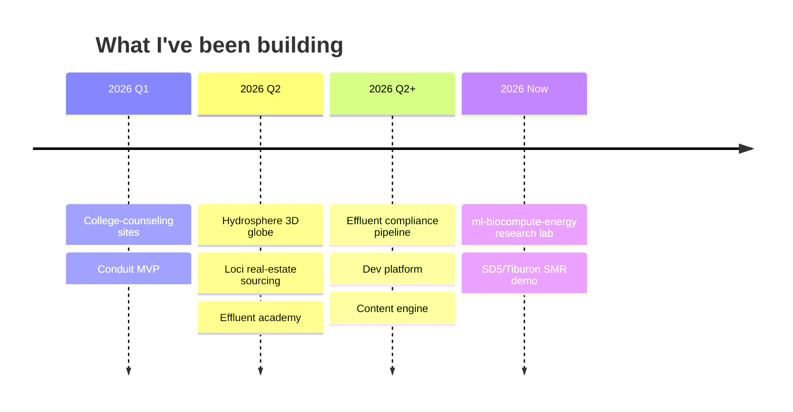

<div align="center">


<br/><br/>


<br/>

<a href="https://instagram.com/mahesh.biz"></a>
<a href="https://instagram.com/mahesh.biz"></a>


</div>

<br/>

## whoami

```python
class Mahesh:
    def __init__(self):
        self.role         = "CEO & Co-founder @ Effluent"
        self.company      = "The Wastewater Intelligence Company"
        self.mission      = "Make environmental compliance autonomous"
        self.now_building = ["Effluent — water-treatment compliance pipeline",
                             "ml-biocompute-energy — research lab"]
        self.interests    = ["multivariate time-series anomaly detection",
                             "biocomputation", "energy / process optimization",
                             "control systems", "go-to-market"]
        self.philosophy   = "Tracer bullets. Crash early. Find the bug once."

    def current_focus(self):
        return "SCADA -> harmonized readings -> autonomous DMR/SMR submission"
```

<br/>

## What I'm building

| Domain | What it is |
|---|---|
| **Effluent** | Five-layer compliance pipeline: edge agent -> harmonized readings -> permit limits -> compliance state -> regulatory submission (NetDMR / CIWQS / signed PDF) |
| **ML research** | Graph-deviation networks (GDN) + transformer reconstruction for explainable anomaly detection on water-CPS sensor streams |
| **Biocomputation** | Biology-as-substrate: encoding, optimization, and modeling at the bio/compute boundary |
| **Energy optimization** | Process-level efficiency — aeration / oxygen transfer, blower sizing, control-loop tuning |

<br/>

## Stack


<br/>

## Stats

<div align="center">


</div>

<br/>

## Activity

<div align="center">


</div>

<br/>

## Trophies

<div align="center">


</div>

<br/>

## Build timeline



<br/>

## Featured

<div align="center">

<a href="https://github.com/maheshwarmurugesan/hydrosphere">
  
</a>
<a href="https://github.com/maheshwarmurugesan/ml-biocompute-energy">
  
</a>

</div>

<br/>

## 💩

<div align="center">

<picture>
  <source media="(prefers-color-scheme: dark)" srcset="https://raw.githubusercontent.com/maheshwarmurugesan/maheshwarmurugesan/output/snake-dark.svg?v=3" />
  <source media="(prefers-color-scheme: light)" srcset="https://raw.githubusercontent.com/maheshwarmurugesan/maheshwarmurugesan/output/snake.svg?v=3" />
  
</picture>

</div>

<br/>

<div align="center">


<sub><i>Make environmental compliance autonomous.</i></sub>

</div>
