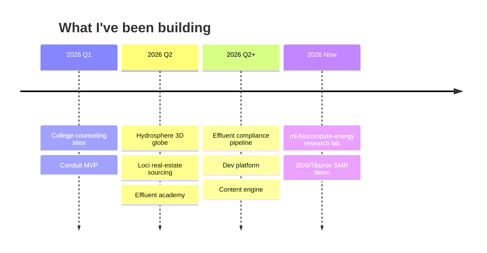

<div align="center">

<a href="https://github.com/maheshwarmurugesan">
  
</a>

<a href="https://github.com/maheshwarmurugesan">
  
</a>

<br/>

<a href="https://github.com/maheshwarmurugesan?tab=followers"></a>


</div>

---

## ⚡ whoami

```python
class Mahesh:
    def __init__(self):
        self.role        = "CEO & Co-founder @ Effluent"
        self.mission     = "Make environmental compliance autonomous"
        self.now_building = ["Effluent — water-treatment compliance pipeline",
                             "ml-biocompute-energy — research lab"]
        self.interests   = ["multivariate time-series anomaly detection",
                             "biocomputation", "energy / process optimization",
                             "control systems", "go-to-market"]
        self.philosophy  = "Tracer bullets. Crash early. Find the bug once."

    def current_focus(self):
        return "SCADA → harmonized readings → autonomous DMR/SMR submission"
```

---

## 🧪 What I'm working on

| Domain | What it is |
|---|---|
| 🌊 **Effluent** | Five-layer compliance pipeline: edge agent → harmonized readings → permit limits → compliance state → regulatory submission (NetDMR / CIWQS / signed PDF) |
| 🤖 **ML research** | Graph-deviation networks (GDN) + transformer reconstruction for explainable anomaly detection on water-CPS sensor streams |
| 🧬 **Biocomputation** | Biology-as-substrate: encoding, optimization, and modeling at the bio/compute boundary |
| 🔋 **Energy optimization** | Process-level efficiency — aeration / oxygen transfer, blower sizing, control-loop tuning |

---

## 🛠️ Stack


---

## 📊 Stats

<div align="center">


</div>

---

## 📈 Activity

<div align="center">


</div>

---

## 🏆 Trophies

<div align="center">


</div>

---

## 🧭 Build timeline



---

## 📌 Featured

<div align="center">

<a href="https://github.com/maheshwarmurugesan/hydrosphere">
  
</a>
<a href="https://github.com/maheshwarmurugesan/ml-biocompute-energy">
  
</a>

</div>

---

## 🐍 Contribution snake

<div align="center">

<picture>
  <source media="(prefers-color-scheme: dark)" srcset="https://raw.githubusercontent.com/maheshwarmurugesan/maheshwarmurugesan/output/snake-dark.svg?v=2" />
  <source media="(prefers-color-scheme: light)" srcset="https://raw.githubusercontent.com/maheshwarmurugesan/maheshwarmurugesan/output/snake.svg?v=2" />
  
</picture>

</div>

---

<div align="center">


<i>"Make environmental compliance autonomous."</i>

</div>
